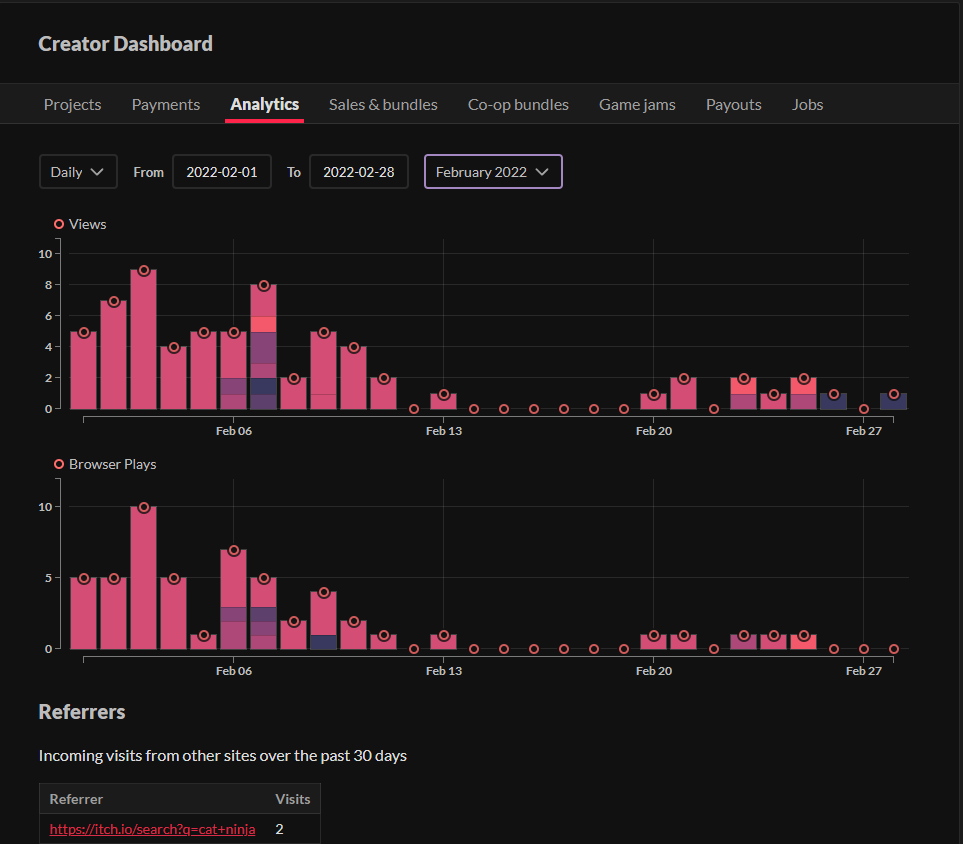
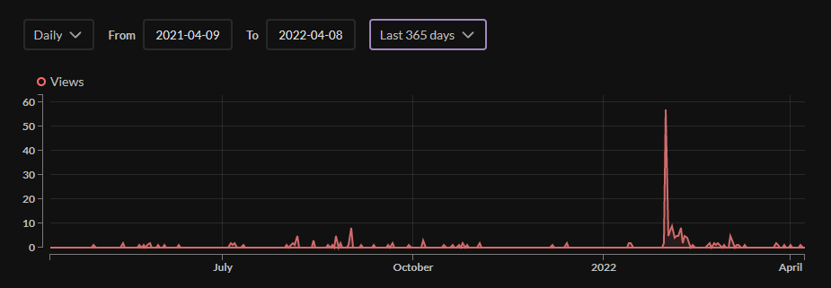
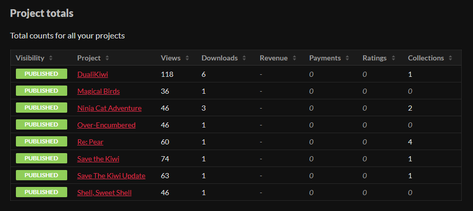
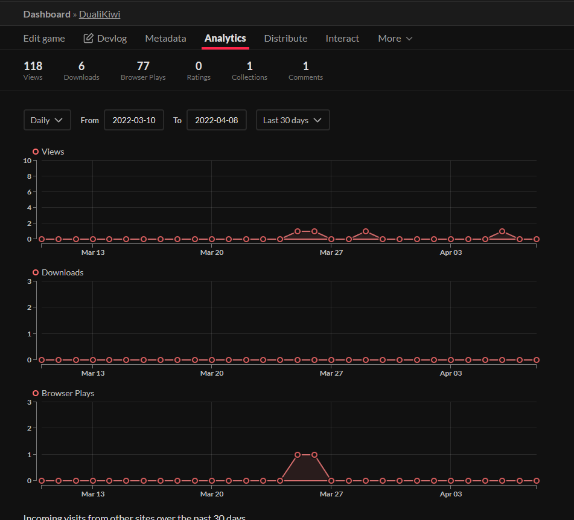
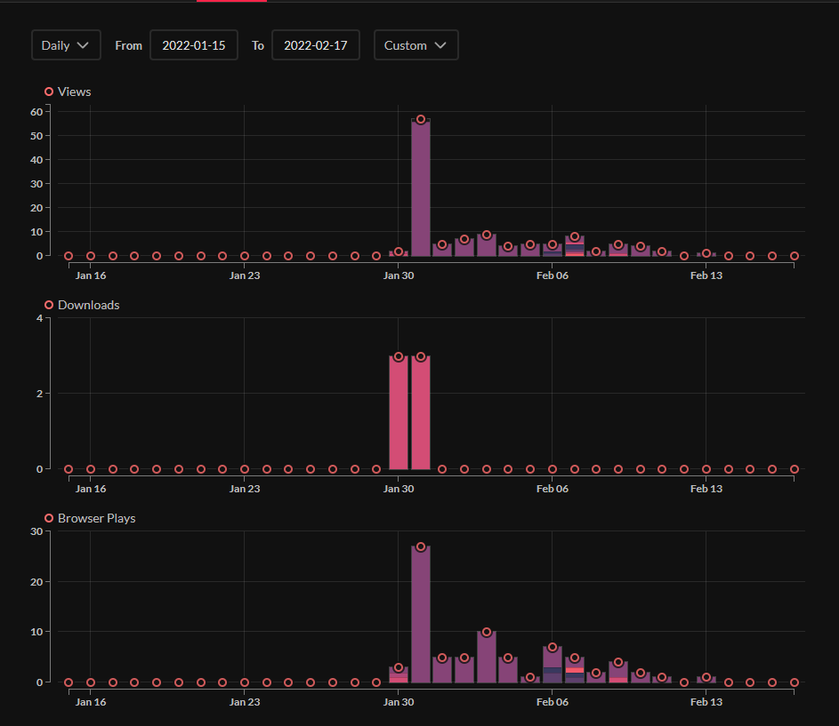
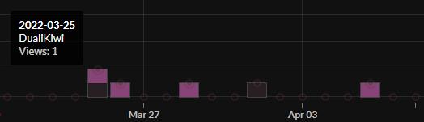
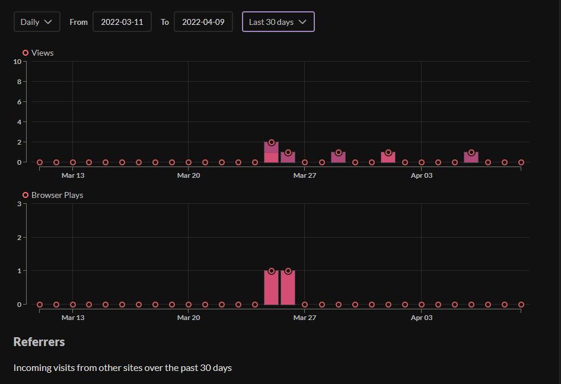
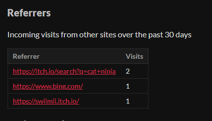

# Critique of the Itch.io Analytics Dashboard

The purpose of the Itch.io Analytics Dashboard is to allow Itch.io developers to observe interest trends
and revenue for their published games. Whenever a user visits a published game's page, downloads a game, or
plays a web build of a game, that action is automatically logged, and displayed in this visualization.

## Who are the users that this visualization was made for?
This visualization was created so that developers (me 😃)  could visualize interest
in their projects over time. If this visualization, and if the data wasn't available,
itch.io developers wouldn't be able to understand how their ads or promotions
affect sales.

## Answering questions with this visualization
### 1. Have sales / ad campaigns effectively increased sales? Which campaigns have been the most effective?
Users can observe spikes and upward trends in the visualization to come to 
conclusions about the effectiveness of timed events or promotions.

### 2. What are the most successful titles we've released?
Below the main view of the analytics dashboard is the Project Totals section.
In the Project Totals section, viewers can observe interest and revenue totals for 
all projects. This allows for an easy understanding of which projects have been the most
successful and which have been the most lucrative.

### 3. What are the trends for the game "Dualikiwi" ?
After clicking on "Dualikiwi" in one of the other visualizations, the user is presented
with a visualization filtered to show only data about Dualikiwi.

## Show some example insights someone can arrive at using this tool
The game Dualikiwi was published on the evening of January 30th. This tool
allows me to observe how interest in the game changed over time, as the game
was released, and word spread of it having been created.

## What design choices are effective?
The use of stacked bar charts is effective for comparing games' interest while still showing peaks in data over time.
And, if the user wants to omit comparisons and just view trends for one title, they can always
choose to view the game-specific chart.

Additionally, an effective quality-of-life feature is that "downloads" and "browser plays" 
charts only appear if the selected time range contains instances of those actions. This
prevents the page from being filled with information that's unnecessary for some users.

## What are the limitations of this design - what can't someone do with this visualization?
This visualization doesn't appear show anything about outside sources which could affect sales.
For example, if the game was placed on Sale or if an ad campaign was started, the user
would have to know that information ahead of time.

Also: the visuaization allows the user to observe a maxiumum of 1 year's data. While that
is a lot of time, the user would have to adjust the view and record what they see to 
understaand the data over a span of over a year.

Lastly, below the visualization's charts is the "Referrers" table. This section is helpful in 
understanding the source of interest for recent visits, but the section only shows the reference 
links for the past 30 days, and doesn't update with the rest of the charts as the time
range is changed. If this visualization updated with the date selection, it would be much
more helpful, and provide much more insight.

## Are there any design choices that are not effective, and how could they be improved?
When interacting with the bar chart view, if a bar has a value near 0, the circle at the
top of the bar can obscure the bar enough that it can't be clicked. While this wouldn't 
typically matteer, since the value is low on that date to begin with, it did cause issues
for me when tring to see which game of mine had a view on a nonzero-but-low-interest date.
